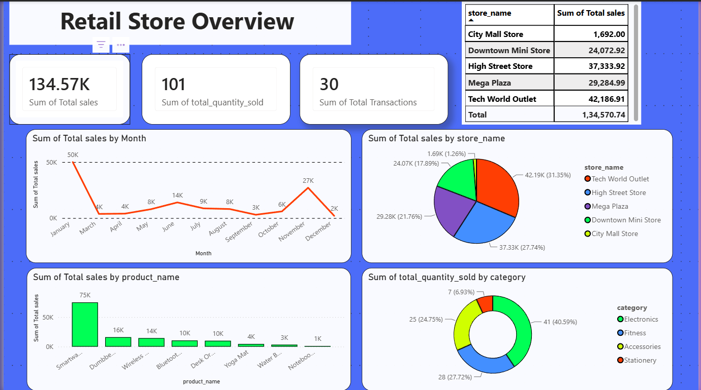

# End-to-End Retail Store Data Engineering & Analytics Project

An end-to-end Data Engineering pipeline using Azure, Databricks, and Power BI to ingest, clean, aggregate, and visualize retail sales data.

## 🏗️ Project Architecture

The architecture follows a modern Lakehouse pattern utilizing the Medallion Architecture layer setup:
1. **Source**: Transactional retail data stored in an Azure SQL Database.
2. **Ingestion**: Azure Data Factory runs orchestration pipelines to copy source tables (`transactions`, `product`, `store`, `customer`) into ADLS Gen2.
3. **Storage**: Azure Data Lake Storage Gen2 partitioned into **Bronze**, **Silver**, and **Gold** layers.
4. **Processing**: Azure Databricks processes the raw Parquet datasets into clean records (Silver) and builds a unified analytics fact table (Gold) using PySpark.
5. **Visualization**: Power BI connects to the Databricks cluster to serve a rich executive business intelligence dashboard.

---

## 💻 Tech Stack & Azure Services
- **Data Orchestration**: Azure Data Factory (ADF V2)
- **Compute/Processing**: Azure Databricks (Apache Spark / PySpark)
- **Storage FileSystem**: Azure Data Lake Storage Gen2 (ADLS Gen2)
- **Database Source**: Azure SQL Database
- **Business Intelligence**: Power BI Desktop (Import Mode)

---

## 📊 Power BI Dashboard Insights

### 🖼️ Dashboard Preview

The pre-calculated Gold Summary table answers crucial corporate KPIs instantly:
- **Category Demand**: Highlighting Electronics as the main driver of scale ($134.57K overall sales).
- **Store Performance Analysis**: Identifying "Tech World Outlet" (Bangalore) and "High Street Store" (Delhi) as regional anchor points.
- **Seasonal Distribution**: Tracks monthly trends showing distinct demand dips post-Q1 and recovery waves toward peak volume in November.

### 🖼️ Dashboard Preview
